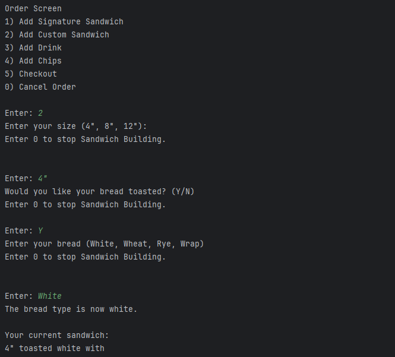
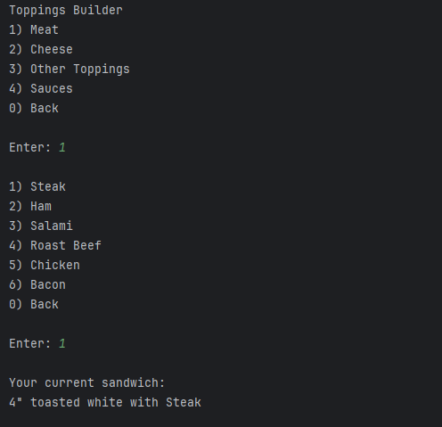
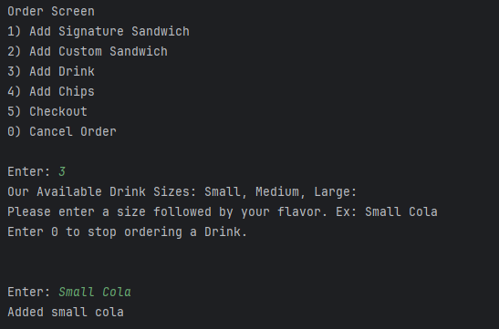
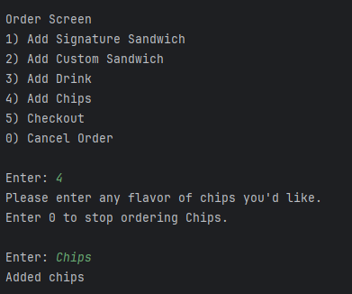
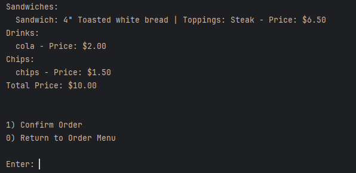
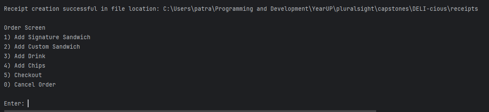
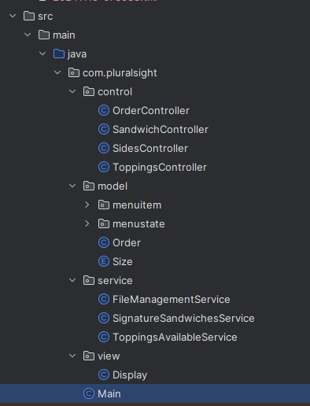

# DELI-cious Command Line Interface
## Class Diagram

## Project Description

The DELI-cious command line interface allows for a user to manually enter orders to save to a receipt txt file.
The items that can be tracked by the receipt include:

### Sandwiches with:
- Bread
- Toppings
- Premium Toppings 
- Sauces
- Price
### Drinks
- Flavor
- Price

### Chips
- Flavor
- Price

After the user builds their sandwich and buys their side items within the modular interface, the receipt file tracks the price of each available item.
The receipt file is written to the receipts/ directory with a "yyyyMMdd-HHmmss" pattern.

## User Stories
> - As a user, I want to have an option to place an order so that I can start choosing items to purchase.
> - As a user, I want to have an option to exit the application so that I can leave without placing an order if I change my mind.
> - As a user, I want to be able to pick between items like sandwich, drink, and chips so that I can customize my order with the available options.
> - As a user, I want to be able to customize my sandwich by selecting bread type, adding meat, cheese, and other toppings, and choosing sauces so that I can create a sandwich to my taste.
> - As a user, I want to be able to pick a drink so that I can include a beverage with my meal.
> - As a user, I want to be able to see the items I’ve picked and confirm them so that I can review my order before finalizing.
> - As a user, I want to be able to place a new order or leave after completing an order so that I can start a fresh order or exit the application.

## Setup

Instructions on how to set up and run the project using IntelliJ IDEA.

### Prerequisites

- IntelliJ IDEA: Ensure you have IntelliJ IDEA installed, which you can download from [here](https://www.jetbrains.com/idea/download/).
- Java SDK: Make sure Java SDK is installed and configured in IntelliJ.

### Running the Application in IntelliJ

Follow these steps to get your application running within IntelliJ IDEA:

1. Open IntelliJ IDEA.
2. Select "Open" and navigate to the directory where you cloned or downloaded the project.
3. After the project opens, wait for IntelliJ to index the files and set up the project.
4. Find the main class with the `public static void main(String[] args)` method.
5. Right-click on the file and select 'Run 'YourMainClassName.main()'' to start the application.
 
## Technologies Used

- IntelliJ IDEA 2023.3.3 (Ultimate Edition)
- Java 17 (Amazon Corretto 17.0.12)

## Demo
### The Order Screen and Sandwich Initialization

### Toppings Builder Menu

### Ordering a Drink

### Ordering Chips

### Preview of Receipt

### Receipt Creation

## Unique Feature: Model View Controller
I tried to force myself to learn about Model View Controller and Services as I worked on this project.

## Future Work

- Adapt table visual to allow for more characters per cell
- Custom Search
- Inline Comments and Documentation

## Resources

- [BigDecimal Documentation](https://docs.oracle.com/javase/8/docs/api/java/math/BigDecimal.html)
- [Year Documentation](https://docs.oracle.com/en/java/javase/21/docs/api/java.base/java/time/Year.html)
- [YearMonth Documentation](https://docs.oracle.com/en/java/javase/21/docs/api/java.base/java/time/YearMonth.html)
- [Center Text Function (Stack Overflow)](https://stackoverflow.com/questions/8154366/how-to-center-a-string-using-string-format)

## Thanks

Thank you to Raymond Maroun for continuous support and guidance.