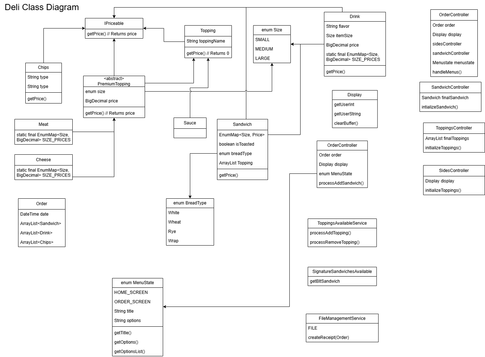

# DELI-cious Command Line Interface
## Class Diagram

## Project Description

The DELI-cious command line interface allows for a user to manually enter orders to save to a receipt txt file.
The items that can be tracked by the receipt include:

### Sandwiches with:
- Bread
- Toppings
- Premium Toppings 
- Sauces
- Price
### Drinks
- Flavor
- Price

### Chips
- Flavor
- Price

After the user builds their sandwich and buys their side items within the modular interface, the receipt file tracks the price of each available item.
The receipt file is written to the receipts/ directory with a "yyyyMMdd-HHmmss" pattern.

## User Stories
> - As a user, I would like different sizes, so I can buy what fits my appetite at the time.
> - As a customer, I want to be able to have a sandwich so that it can have various sizes, bread types, be toasted, and toppings.
> - As a user, I would like to have various toppings including meat, vegetables, and sauces, so that I can customize my sandwich to my liking.
> - As a user I would like to have the ability to order a drink of various sizes, so that I can have something on the side to go with my order.
> - As a user I would like to be able to see my Order in an organized and calculated way, so that I know exactly what I am spending money on.
> - As a user I would like the ability to order chips so that I can have something on the side of my Deli-cious sandwich.
> - As a user I would like to know what all toppings are available, so that I can make an informed choice on what to put on my sandwich.
> - As a user I would like to navigate easy to read menus, so that I can get to where I need effectively and simply.
> - As a user I would like to have my receipt saved to a file that I can easily access, so that I can retrieve this information later for personal accounting.

## Setup

Instructions on how to set up and run the project using IntelliJ IDEA.

### Prerequisites

- IntelliJ IDEA: Ensure you have IntelliJ IDEA installed, which you can download from [here](https://www.jetbrains.com/idea/download/).
- Java SDK: Make sure Java SDK is installed and configured in IntelliJ.

### Running the Application in IntelliJ

Follow these steps to get your application running within IntelliJ IDEA:

1. Open IntelliJ IDEA.
2. Select "Open" and navigate to the directory where you cloned or downloaded the project.
3. After the project opens, wait for IntelliJ to index the files and set up the project.
4. Find the main class with the `public static void main(String[] args)` method.
5. Right-click on the file and select 'Run 'YourMainClassName.main()'' to start the application.
 
## Technologies Used

- IntelliJ IDEA 2023.3.3 (Ultimate Edition)
- Java 17 (Amazon Corretto 17.0.12)

## Demo
### The Order Screen and Sandwich Initialization

### Toppings Builder Menu

### Ordering a Drink

### Ordering Chips

### Preview of Receipt

### Receipt Creation

## Unique Feature: Model View Controller
I tried to force myself to learn about Model View Controller and Services as I worked on this project.

## Future Work

- Add a Remove item feature
- Implement Singleton pattern for ToppingService
- Inline Comments and Documentation

## Resources

- [BigDecimal Documentation](https://docs.oracle.com/javase/8/docs/api/java/math/BigDecimal.html)
- [StackOverflow](https://stackoverflow.com/a/2965252)
- [Observer Pattern (even though I couldn't implement it)](https://www.geeksforgeeks.org/observer-pattern-set-1-introduction/)
- [MVC Research 1](https://www.youtube.com/watch?v=DUg2SWWK18I)
- [MVC Research 2](https://www.youtube.com/watch?v=FYOMpzia_Dk)

## Thanks

Thank you to Raymond Maroun for continuous support and guidance.